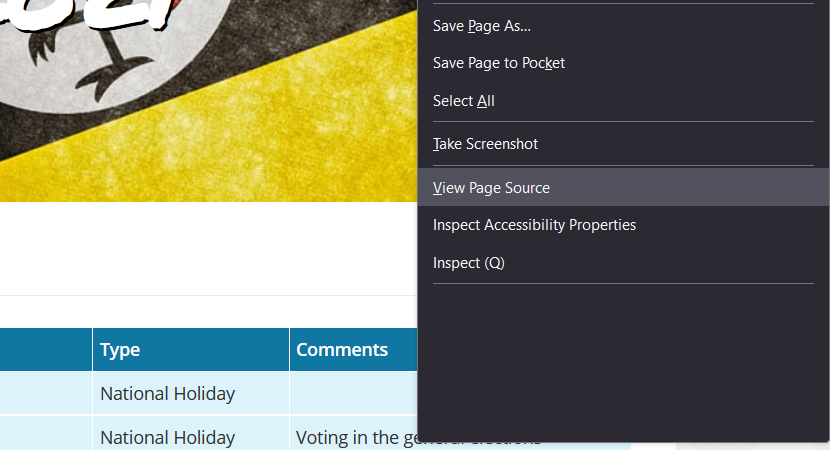
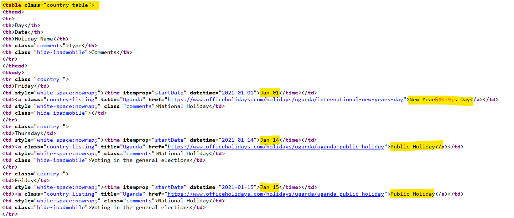

The other day I was asked about public holidays in my home country - and if you didn't know, I am from Uganda. So this question got me thinking that it would make for a good post to practice how I could scrape the information I need to answer this question.

## Step 0 - What do you need?

For this exercise, you will need to install R, Rstudio (or any other text editor that you prefer to use) and the following packages:

-   **tibble**, for storing data in a tabular format.

-   **dplyr**, for data manipulation.

-   **ggplot2**, for data visualisation.

-   **tidyr**, for creating tidy data.

-   **rvest**, for harvesting data from web sites.

## Step 1 - Where is the data?

So I needed to find a site that had this information. A quick Google search brought me to [Office Holidays](https://www.officeholidays.com/) that lists for several countries. Naturally, I looked for my own [country](https://www.officeholidays.com/countries/uganda/) and beauty is that it has data from **2017 - 2024**.

So, to get the public holidays for 2021, the URL would look like:

```{text}
https://www.officeholidays.com/countries/uganda/2021
```
Going forward, we can use the following URL structure to scrape data for a particular country and year.

```{text}
https://www.officeholidays.com/countries/{country}/{year}
```
## Step 2 - How do we find the data to scrape? 

To do this, we will have to understand the structure of the web page and be able to identify "where" the data sits.

Let's open up the [Uganda](https://www.officeholidays.com/countries/uganda/2021) holiday page for 2021. We can then view the page source by right clicking anywhere on the page and selecting "View Page Source" (for this example I used Firefox but most browsers should be similar).



Given that we are looking for a "table" of information, look through the source code to see whether you can find a similar structure. Highlighted below, we can see that the data is in a \<table class="country-table"\> HTML tag and I have highlighted a few data points that we would like to capture as well.



Keep this tag in mind as we will need to pass it into R to scrape.

## Step 3 - Let's scrape the data!

To scrape the data, we shall use a package called [**rvest**](https://rvest.tidyverse.org/). This package has functions that enables one to:

- Read in the HTML page.
- Narrow down to the specific tags or elements referencing the data.
- Extract the sought after data which, in our case, will be in the form of a tibble.

Let's extract the data holding the public holiday information for [Uganda](https://www.officeholidays.com/countries/uganda/2021) in 2021:

```{r warning=FALSE, message=FALSE}
library(tibble)
library(ggplot2)
library(dplyr)
library(tidyr)
library(rvest)

url <- 'https://www.officeholidays.com/countries/uganda/2021'
site <- read_html(url) # Grab the HTML page

data <- site %>%
  rvest::html_element('table') %>% # Extract the first <table> from the HTML page.
  html_table

```

**NOTE** - if you use the `html_elements` function (with an 's' at the end), this will extract all the tables in document as a list of tibbles. From this, you can extract the appropriate table from the list (which would be the first in the list).

We now have our dataset:

```{r} 
data
```

## Step 4 - How might we improve on this script?

We still need to be able to scrape the data tables for the other years. To do this, we create a function that takes the year of interest and pull the public holiday table for that year. 

If we want to include other countries as well, we can add a second parameter to the function for country, but keep the default to one - in this case Uganda.

We can then use a mapping function from the **purrr** package to iterate through the list. If you are brave, you could use the **furrr** package instead for a more parallelised experience.

**BUT** do keep the host of the information in mind. Too many requests too fast could bring down the site which is not only unfair but may violate the usage policies of the site.

Let's improve on our script function:

```{r warning=FALSE, message=FALSE}
library(purrr)

# General Uniform Resource Identifier that will be customised
uri <- 'https://www.officeholidays.com/countries'

# Function to extract data using customised URL from URI.
extract_data <- function(year = 2021, country = 'uganda') {
  read_html(paste0(uri, '/', country, '/', year, '/')) %>% # Add parameters to create URL
    html_element('table') %>%
    html_table %>%
    mutate(year = year) # Add a column of year so we know the year of reference
}

## Extract data from the range of years.
years <- 2017:2024

data <- map(.x = years, 
            .f = function(year) extract_data(year = year)) %>% 
  bind_rows() # Combine all the data into a single tibble

# And finally, let's also clean up the data as well

# Import additional packages to clean up dates and column headers
library(lubridate)
library(janitor)

data <- data %>%
  clean_names() %>% # Clean the dataset column headers
  mutate(date = mdy(paste(date, year))) %>% # Clean the date field
  select(-c(type, year)) # Discard irrelevant fields

```

And we are done! Here are the first holidays for each year that we captured.

```{r}
data %>% 
  group_by(year(date)) %>% 
  slice(1) %>% 
  ungroup()

```
## Step 5 - What can we do with this information?

We can find a number of facts with this information. As an example, you could find the *number of holidays per year*:

```{r warning=FALSE}
holidays <- data %>% 
  group_by(year(date)) %>%
  summarise(number_of_days = n()) %>%
  ungroup() %>%
  rename('year' = contains('year')) 

holidays %>% 
  ggplot(aes(x = year, y = number_of_days)) + 
  geom_bar(
    data = holidays %>% 
      mutate(is_max = number_of_days == max(number_of_days)), 
    aes(fill = is_max), 
    stat = 'identity', 
    show.legend = FALSE) + 
  geom_text(data = holidays, aes(label = number_of_days), 
            nudge_y = .5, family = 'cambria', size = 3) + 
  theme(
    plot.background = element_blank(),
    panel.grid = element_blank(),
    panel.background = element_blank(),
    axis.line = element_blank(),
    axis.ticks = element_blank(),
    axis.text.y = element_blank()
  ) + 
  labs(
    title = 'Number of Public Holidays',
    subtitle = 'per year',
    x = '',
    y = ''
  ) + 
  scale_x_discrete(limits = years)

```

You could also find out which month each year has the largest number of days:

```{r warning=FALSE, message=FALSE}

data %>% 
  group_by(year(date), month(date, label = TRUE)) %>% 
  summarise(count = n()) %>% 
  rename(year = contains("year"), month = contains('month')) %>% 
  ungroup() %>% 
  group_by(year) %>% 
  filter(count == max(count)) %>% 
  ungroup()

```

You can use that information to make your leave plans! 