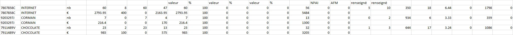
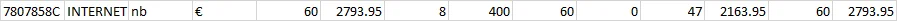

As I was strolling through reddit and came across an interesting data cleaning request by [u/PoisonDaddy29](https://www.reddit.com/r/datascience/comments/11edvca/data_cleaning_help_please/).

Breaking down the request, it seemed like a typical transposing problem, but with an interesting twist - with grouped data.

Let's break this down a bit.

This is the original sample data:

And this is the expected output data: 

Looking at the output and working backwards, you will notice a couple of things:

1. *The data appears to be grouped, but not aggregated.* 

2. *The data beyond the grouped fields are transposed but alternating* 

Looking at the first row [INTERNET] of the output and the first two rows of the original sample dataset [INTERNET], you will notice a pattern. Data in the first row of the original dataset occupy the "odd" columns of the output dataset, and data in the second row form the "even" columns. 