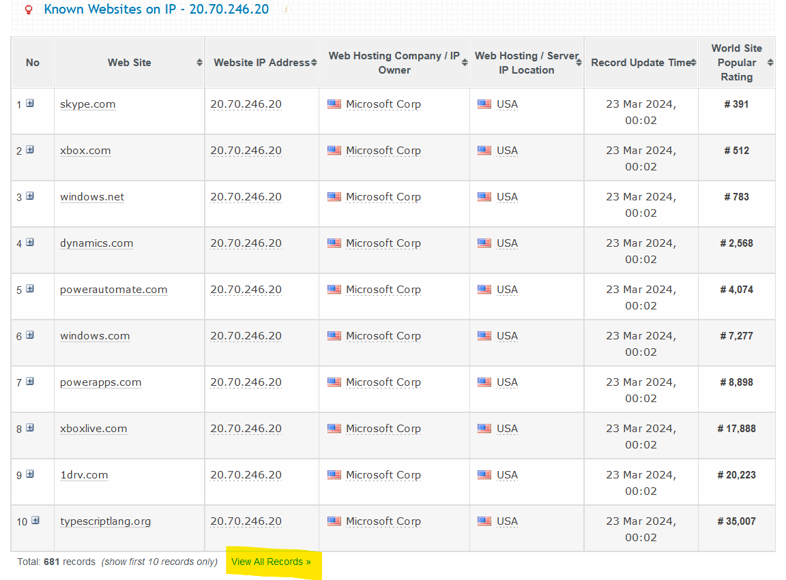
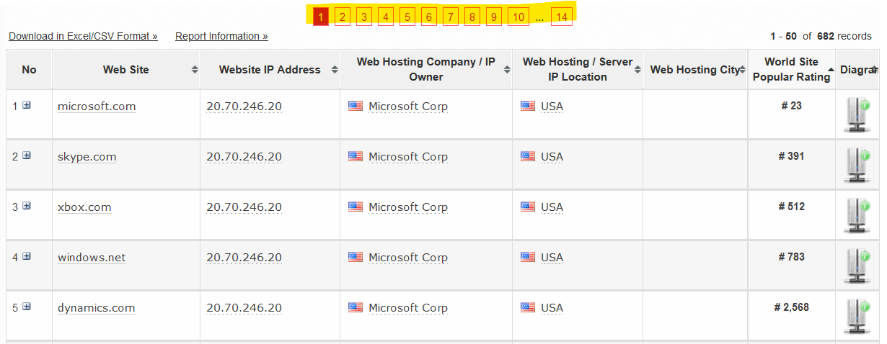

For this exercise, we shall be extracting a table from search results that often has the data in a table that spans multiple pages. Our example site will be [myip.ms](https://myip.ms) that pulls hosting information for particular IPs or domains. It is fairly common for IT professionals and hobbyists to see which kind of websites are hosted on a particular IP or domain address.

## The Exercise

We are interested in knowing the sub-domains / websites hosted on the same IP address as **microsoft.com**. So we punch this address into the "Whois Lookup" field at the top of the page and scroll to the first table with the heading **Known Websites on IP - 20.70.246.20**.



We then select the hyperlink **View All Records** and this takes us to the full list of Known IP addresses and links.



You will realise that the table generates 50 results at a time, with the highlighted navigation page numbers at the top (and bottom) of the table to guide you through the records. These numbers would correspond to the number in **bold** after ***/sites/*** in the URL as demonstrated below:

- https://myip.ms/browse/sites/**1**/ipID/20.70.246.20/ipIDii/20.70.246.20
- https://myip.ms/browse/sites/**2**/ipID/20.70.246.20/ipIDii/20.70.246.20
- https://myip.ms/browse/sites/**3**/ipID/20.70.246.20/ipIDii/20.70.246.20
- https://myip.ms/browse/sites/**4**/ipID/20.70.246.20/ipIDii/20.70.246.20

This would mean that we will have to create a script that generates 14 links (as seen from the number of table pages in the previous screenshot) and iterate through each one to extract the relevant information.

**Please note** that as you do this exercise, you need to keep in mind on not to overwhelm the site with requests, that is, we should not be hitting the site with too many requests as it takes away resources from other users. Please be judicious as you go about this exercise.

```{r load_data}

# "https://myip.ms/browse/sites/1/ipID/20.70.246.20/ipIDii/20.70.246.20"

## We can leverage on the 'seq' function to generate a list of numbers from 
## 1 - 14. Each number can be passed into the 'paste' function to create a
## unique link.

pages <- sapply(seq(1,14), function(page_number) 
  paste("https://myips.ms/browse/sites/", 
        page_number, 
        "/ipID/20.70.246.20/ipIDii/20.70.246.20", 
        sep = ""))

pages

```
Now armed with the links, we can attempt to scrape the tables from the links. We will apply the **Sys.sleep** function to allow the script "breathe" before each page.

```{r scrape_data}
library(rvest)

test_url <- "https://myips.ms/browse/sites/1/ipID/20.70.246.20/ipIDii/20.70.246.20"

```
