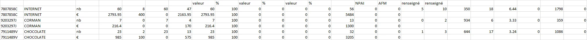
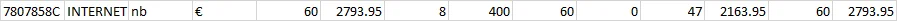

As I was strolling through reddit and came across an interesting data cleaning request by [u/PoisonDaddy29](https://www.reddit.com/r/datascience/comments/11edvca/data_cleaning_help_please/).

Breaking down the request, it seemed like a typical transposing problem, but with an interesting twist - with grouped data.

Let's break this down a bit.

This is the original sample data:



And this is the expected output data: 

Looking at the output and working towards the original data, you will notice a couple of things:

1. **The data appears to be grouped, but not aggregated.**

There's one line per ID and Type (e.g. 7807858C, INTERNET). This implies that its most likely that the data is grouped by a certain condition - which we determine in 2. below.

2. **The data beyond the grouped fields (ID and Type) are transposed but alternating** 

Looking at the first row (7807858C, INTERNET) of the output and the first two rows of the original sample dataset (7807858C, INTERNET), you will notice a pattern. Data in the first row of the original dataset occupy the "odd" columns of the output dataset, and data in the second row form the "even" columns.

As an example, if we look at the data in the first two rows (7807858C, INTERNET) of the original dataset, the mapping the data in the third column (which I am assuming is perhaps the currency column) to the output dataset has "nb" is in the third column of the output data and "€" is in the fourth. Repeating this for the fourth column has "60" in the fifth column of the output dataset and "2793.95" in the sixth column.

3. **The output is only interested in a subset of the data**

From the output, we can see that the final output is only interested in the first 8 columns of the original dataset - the column named "valeur". So as part of our script, we will only subset the first 8 columns.

With these few notes out of the way, we can break down the solution:

- Import the data

```{r message=FALSE}
## Load necessary libraries ----

library(dplyr)
library(readxl)
library(tidyr)
library(gt)

## Import dataset and clean it up a bit ----

file <- '0ktnv66mmyka1.xlsx'

data <- read_xlsx(file, sheet = 1)

# Give column headers some generic names
column_names <- paste0('c', seq(1,ncol(data)))
names(data) <- column_names

# Nest the data by the ID and Type columns (there are two rows being nested)
nested_data <- data %>% 
    select(c1:c8) %>% 
    group_by(c1, c2) %>% 
    nest() %>% ungroup


## Apply transposition for each row with nested data ----
output <- lapply(1:nrow(nested_data), function(row) {
    sample_row <- nested_data[row, ] # Extract a row
    sample_row %>% 
        unnest(data) %>% # Unnest data in row
#        ungroup() %>% 
        select(c3:c8) %>% # Select columns corresponding to the nested data (two rows)
        lapply(FUN = function(x) t(x)) %>% # Pass column and transpose
        data.frame %>% # Convert into a data frame with one row
        bind_cols(select(sample_row, c(c1,c2)), .) # Append ID and type to data frame
}) %>% # Output makes a list of one-row data frames
    bind_rows() # Combine all these lists row-wise to create final data output.

gt::gt(output)

```
And there you have it!